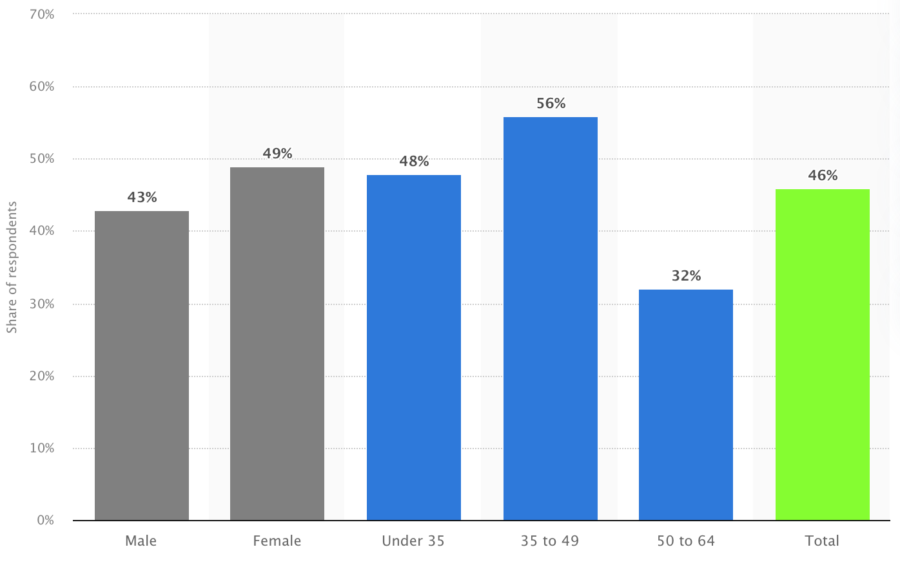

# 1.2 Stakeholders

## Customer Role

As shown previously, around 89.29% of the world's population own a smartphone, resulting in a large market for software applications. In 2022 there were around 0.73 billion downloads of weather apps such as Weather Channel and Clime, and is expected to rise to 1.06 billion by 2027 (Statista, 2023).

<figure><figcaption>
Figure 1: Trends in weather application downloads over the years (Statista, 2022)
</figcaption></figure>

While Statista also suggests that weather apps are only the 23rd most popular category on the Apple App Store for the general public, forecasting software has become increasingly important in other industries such as agricultural farming. Weather forecasting information is also essential in the agriculture industry for crop production and animal farming in strategic choices (Calanca, 2014). According to Fundel et al. (2019), the majority of customers use weather predictions for risk communication, informed decision making and marketing. A large variety of industries, including construction, retail and sports, make use of weather analytics to plan for appointments, monitoring safety and for marketing (Foerster, 2019).

From this research and information from the Met Office, I have identified three main stakeholders for weather application software (Clements et al., 2015). This includes the agriculture industry, businesses, and the general public.

## Demographics

The general public uses weather forecasting software for a variety of reasons, including choosing appropriate clothing and planning future trips (Silver, 2014). Most users access these applications frequently for short-term predictions, the average U.S. adult using forecasts around 115 times per month (Lazo, Morss and Demuth, 2009). However, the issue of accuracy comes in to play when users depend on this data for making long term plans, therefore influencing which app they trust and use.

<figure><figcaption>
Figure 2: The proportion of people categorised by gender and age who use weather applications regularly in Great Britain (Statista, 2013)
</figcaption></figure>

Figure 2 shows that there is no major difference in weather application usage between genders. According to Ruby (2023), iPhones are most popular in the 16-34 age group. It therefore stands to reason that younger generations are one of the main stakeholders for applications. I was surprised to see that the statistics above suggest the highest usage of weather applications is the 35-49 age group. This could suggest that stakeholders make use of weather forecasting for practical decision making and long-term planning. This makes accessibility and usability is an important feature, especially in areas where risk communication is essential (Fundel et al., 2019).

Location is also plays a role in weather application usage.

However, 48% of people aged below 35 still use weather apps regularly. College students mainly use weather applications to gain insight into short-term information such as hourly forecasts (Phan et al., 2018).

* Age ranges for mobile phones and weather applications
* How they use those apps
* What features do they look for in weather apps
* age, location, gender, interests, lifestyle, personality, information sources,&#x20;
