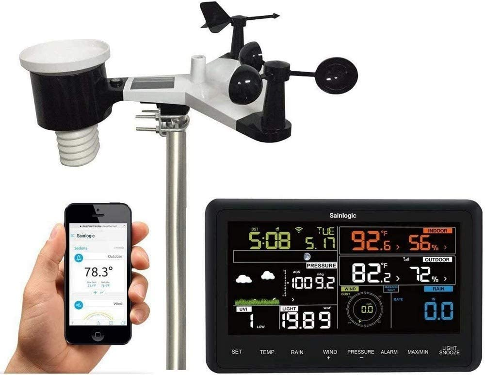

# 1.3 Research

## Personal Weather Station

<figure><figcaption></figcaption></figure>

### Overview

Some description of this existing solution

### Aspect 1 (of 2-4 aspects per solution?)

A more detailed description of some aspect of this solution

### Features



| Feature             | Justification                               |
| ------------------- | ------------------------------------------- |
| Feature description | Some reason it's a good fit in this project |




| Feature             | Justification                                              |
| ------------------- | ---------------------------------------------------------- |
| Feature description | Reason it's beyond the scope/not suitable for this project |



## The Channel Weather App

<figure><figcaption></figcaption></figure>

### Overview

Some description of this existing solution

### Aspect 1 (of 2-4 aspects per solution?)

A more detailed description of some aspect of this solution

### Features

## Weather (apple)

<figure><figcaption></figcaption></figure>

### Overview

Some description of this existing solution

### Aspect 1 (of 2-4 aspects per solution?)

A more detailed description of some aspect of this solution

### Features
