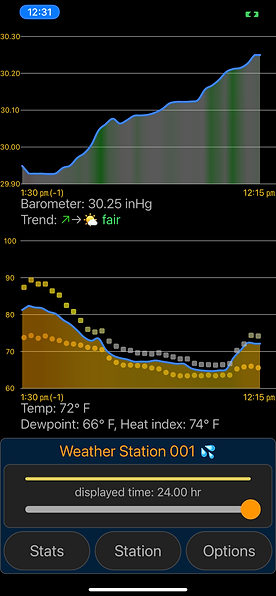

# 1.4a Features of Proposed Solution

## Hardware

In this section I will first focus on the hardware required for this project. In order to collect data from the environment and monitor weather conditions, I must include sensors as part of my solution.

### Sensors

I will need a variety of sensors to take readings from the environment. According to Kodali and Mandal (2016), the basic data needed in IoT automated weather stations include temperature, humidity, pressure, light intensity and and precipitation. I will also use an air quality sensor to measure the levels of pollution in the air.

<figure><figcaption>
Examples of air quality, temperature and humidity sensors
</figcaption></figure>

In order to collect data, these sensors will need to be connected to a development board that is programmed to take readings at regular intervals. It will then need to connect to the internet via WIFI or cellular services to upload data.

### Data collection

Having collected this data using sensors, I will now need to transmit it to the internet and save it to a database to be accessed by my application. For this I will use a development board, or a device that already has sensors contained within it. Below shows examples of designs for weather monitoring systems.

<figure><figcaption>
An example of a weather station using temperature sensors and a Particle Argon development board (Schnepf, Hayes and Andrijanoff, 2021)
</figcaption></figure>

<figure><figcaption>
An examle of a weather monitoring system, using a Raspberry Pi
</figcaption></figure>

The reason why I am designing a weather station as part of my solution as it will allow me to accurately measure conditions using sensors from the stakeholders location. I can then use software to interact with this hardware in order to monitor and forecast weather.

## Software

Having looked at the hardware required for this project, I will now examine the software required to monitor and forecast weather, as well as an application to display this data.

### Monitoring

Monitoring weather conditions is an important aspect of my solution as it involves presenting the data collected by sensors in a format that a stakeholder can use. I will display this data on a web-based or smartphone application so that it is easily accessable, allowing the user to make informed decisions. All data will need to be pulled from a database at regular intervals, to ensure all information is up to date. Weather conditions I wish to monitor include temperature, pressure, humidity and air quality.&#x20;

Another feature of monitoring data is comparing weather conditions and analysing trends over time. Many weather applications do this in the form of a graph, tracking measurements over the course of days, weeks and months. An example of the ways I could present trends in weather conditions are shown below:

<figure><figcaption>
Example of graphs for monitoring
</figcaption></figure>

&#x20;I will then need to store this data on a database so that it can be accessed overtime. This will allow me to track trends in weather conditions as well as current ones.&#x20;

(section on graphs and tracking trends, using photos)

### Forecasting

The next aspect of my solution is forecasting. In order to predict future weather events, I will need to collect sufficient data. Weather forecasts typically require multiple readings from sensors in different locations to make a prediction. Therefore, I may need to use other readings (e.g. from weather APIs) as well as the data I have collected. According to Weber (2018), the best way to predict weather is measuring changes in atmospheric pressure, clouds, and wind. Having collected sufficient data, I will need to design an algorithm to accurately predict weather conditions within the local area.

### Notifications

An additional feature I want to include in my solution is notifications from the app. This will help inform the stakeholder of any changes in weather conditions, such as temperature, wind, or detecting precipitation. These notifications could also provide a user with an insight to recent trends, such as the weekly average temperature and new forecasts.

### User interface

The final feature is the user interface on which I will display weather data. It will need to present data trends clearly, so that the stakeholder is easily able to interpret the app. Khamaj, Kang and Argyle (2019) found that the stakeholder's perception of a smartphone weather app is vital to its sucess, and the most popular apps incoperated a user-centered design. Therefore, I will use a basic layout with colour so that it can be navigated efficiently and will need to update regularly so it remains accurate. I will need to access this data from a database, and the personal weather station will continuously upload data.&#x20;

<figure><figcaption>
Example of a user interface that displays weather data clearly
</figcaption></figure>

Features I want to include on the user interface:

* Dashboard - This will show weather conditions currently being monitored, such as temperature, humidity and pressure.
* Air quality - I will use sensors to determine the level of polution within the surrounding environment, and describe air quality on a scale (e.g. poor-good).
* Weekly trends - As part of my weather station, I want to present the weekly trends in temperature, air quality and humidity in the form of a graph.
* Forecast - This will show the current conditions as well as predictions for the following days
* Other features - Some weather stations also include other features such as the current date and time, and when the sunrise/sunset is likely to occur. I want to include these features as they would be useful to a stakeholder in decision making and planning.
* Basic, clear design - I want to ensure that my app is easy to navigate by having a simple layout and using colour.

## Limitations

### Continuous data collection

While ideally I would like my weather station to be continuously collecting data, battery life and resistance to weather conditions will limit its ability. I will need to ensure all hardware is waterproofed to prevent damages and is in a location where it has access to the internet.

### Hourly forecasting

Both short and long-term forecasting is a feature that many weather applications possess, but due to time constraints on this project, it would be difficult to make several different predictions at once while maintaining accuracy. Instead, I plan on forecasting less frequently because I want to focus on inproving the quality.

### Weather warnings

While I would like to be able to predict large scale weather events in advance, due to time constraints and accuracy of weather forecasting it would be difficult to set these up using my data. However, I do still plan on using notifications within my app when monitoring trends in data.

### Multiple locations

Many weather applications support a variety of locations. However, as I am focusing on a personal weather system to track local weather, I will not include this as a feature.

